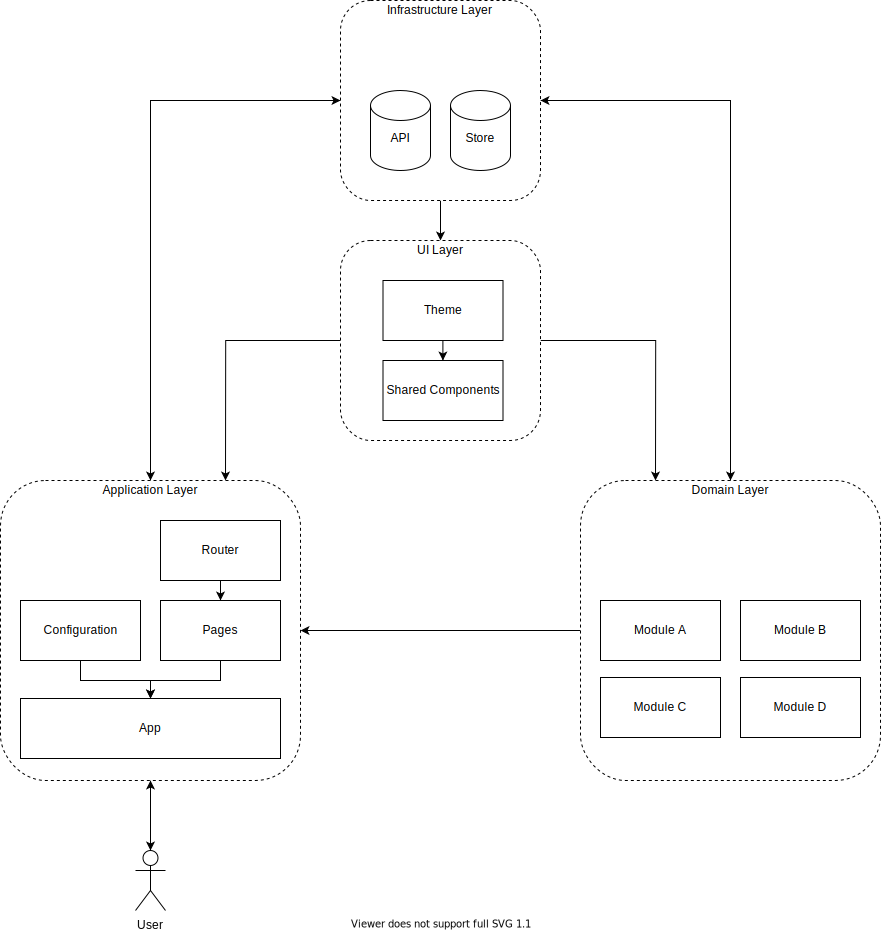

# react-architecture

- Domain Driven Design
- Feature Driven Design

## Domain Driven Design

### Discussion Topic: Does DDD belong in the front-end development space?

- Why business logic doesn't belong in the front-end
  Business logic as a high-level policy that everything else relies on (database, front-end, mobile, etc)

- The real challenge of front-end development
  Typically, in a client-server architecture, the backend acts as the single source of truth.
  The backend that holds all of the high-level policy dictates who is allowed to do what.

Frontend as a low-level detail. Factors:

- Stability
- Volatility

Example:

- Todo App (authenticate w/ backend, store data in db)
- Social Networking Site (authenticate w/ backend, perform commands and queries against resources you have access to determined by the backend - this is domain complexity)

Clean architecture:

> "Components' dependencies should be in the direction of stability" - Uncle Bob

```bash
├── Infrastructure
│   ├── Application
│   │   ├── Domain
```

The domain layer describes how your business works. It is unlikely that your business will drastically change, that means that the code that best describes your business is also unlikely to need change. This means that the domain layer holds the highest level of stability and policy.

Comparing to a traditional generic application architecture:

```
View ---> Presenter (DTO) <--- Controllers --->  Application Layer   <--- Repos ---> Mappers ---> Database
                                                   |- Domain Layer

```

The application layer and the domain layer are in the middle of this architecture, it represents a high-level policy. This makes it expensive to change.

> Components should be open for extension, but closed for modification

Categories of business logic ordered from lowest level policy to highest level policy: 6. Presentation logic 5. Data access logic (caches, databases, front-ends, etc.) 4. Application layer logic / use case (applications like Google's Docs, Sheets, Maps, etc. set of use cases and policy that governs those use cases) 3. Domain layer logic (Core business that doesn't quite fit within the confines of a single entity) 2. Validation logic

1. Core business logic

Goal of every frontend framework is to simplify:

- Define data (data storage)
- Signal that data changes (change detection)
- React to data changes (data flow)

### Drawing Parallels to DDD

```
src
  modules
    ...
    domain
      components
      models
      pages
      state
      services
      styles
    ...
```

Good concepts:

- Hydrating domain models: Backend DTO could return all data required to hydrate the domain
- Real-time domain events: Steady stream of domain events from the backend the frontend can orchestrate what to render

### Takeaway

- Business logic doesn't belong on the frontend because of single-source of truth constraints in centralized applications, the frontend is volatile and prone to change, and components should always point towards the direction of stability.
- Complexity of front-end development is maintaining a consistent architecture based on the decisions of the tech stack, not encapsulating a domain model.
- Being careful to not violate Open-Closed Principle (OCP) when sharing code between the front-end and the back-end. Create a client-side library.
- Applications with heavy amounts of presentation logic are the ones that would most benefit from using a client-side presentation model from hydrated domain objects (DTOs).

## Solid Principles

Single Responsibility Principle

> "A class or function should only have one reason to change."

- Separate responsibility based on the social structure of the users using the application (User > IT, User > HR)

Open-Closed Principle

> "A software artifact should be open for extension but closed for modification.”
> Higher level-components are protected from changes to lower level components.

- Define an interface that specifies what a service can do

Liskov-Substition Principle

> "To build software systems from interchangeable parts, those parts must adhere to a contract that allows those parts to be substituted one for another."

- Interfaces and abstract classes

Interface Segregation Principle

> Prevent classes from relying on things that they dont need

- The 3 user operations example:

```javascript
// bad?

const operations = (User1, User2, User3) => {
  operation1();
  operation2();
  operation3();
};

// good?

const operationsClass = () => {
  return {
    operation1,
    operation2,
    operation3,
  };
};

const user1Operations = (User1) => {
  operationsClass.operation1();
};

const user2Operations = (User1) => {
  operationsClass.operation2();
};
```

Dependency Inversion Principle

> Abstractions should not depend on details. Details should depend on abstractions.
> A de-coupling technique where both high-level and low-level classes depend on the same abstraction, inverting the dependency relationship.

- Don't refer to concrete classes from another concrete class directly
- Hook up dependencies to classes instead

Why is it such a bad thing to depend on concrete classes?

- They're hard source code dependencies. Hard to extend and test

Example of SOLID code: https://github.com/stemmlerjs/solid-email-microservice

## Clean Architecture: Organizing App Logic

Ideally, we want: Infrastructure > Adapter > Application > Domain Layers

Infrastructure Layer

- Controllers
- Routes
- Databases
- Caches
- ORMs

Adapter Layer

- Access to infrastructure and external APIs

Application Layer

- Use cases / Application Services
- Features of the app

Domain Layer

- Entities
- Valued Objects
- Domain Events

### 6 most common types of application logic in large apps:

- Presentation Logic: Logic that's concerned with how we present something to the user.
- Data Access / Adapter Logic: Logic concerned with how we enable access to infrastructure layer concern like caches, databases, frontends, etc.
- Application Logic / Use Cases: Logic that defines the actual features of our app
- Domain Service logic: Core business that doesn't quite fit within the confines of a single entity.
- Validation logic: Logic that dictates what it means for a domain object to be valid.
- Core business logic / entity logic: Logic that belongs to a single entity.

## Feature Driven Design

- Features are vertical slices

```bash
# Feature Structure Example
├── Feature
│   ├── Presentation / UI Logic     # contains UI logic for local component state, view behavior. takes in data, handles user events
│   ├── Container                   # aka controller/route to pages
│   ├── Interaction                 # model behavior. decision-making layer. application's operations (app logic). sometimes several layers: Auth, Logging, Pub/Sub, Render logic, Metadata
│   ├── Transport                   # networking & data fetching (infrastructure). API calls and reporting.
│   ├── Persistence                 # state management & storage (infrastructure), redux, graphql

```

- When we add or change features in an application, we're modifying a part of the vertical slice for that feature

Verticals:

- Create User
- Get User
- Delete User

```bash
# Feature: Create User
├── CreateUser
│   ├── Presentation / UI Logic
│   ├── Container
│   ├── Interaction
│   ├── Transport
│   ├── Persistence

# Feature: Get User
├── GetUser
│   ├── Presentation / UI Logic
│   ├── Container
│   ├── Interaction
│   ├── Transport
│   ├── Persistence

# ...
```

- Understand the responsibilities of each layer allows us to reason which tools to use per feature
- Gives better visibility as to which tasks need to be done, which layer they belong to, and which tools can be used to address those concerns.
- Helps to decide whether we want to implement a layer ourselves or use a framework/library. For example, most developers won't build their own view-layer library for presentational components — they'll use React or Vue. But lots of users will build their own state management system from scratch using Redux and Connect.

## Proposal

```bash
# Infrastructure
├── store
│   ├── redux.js
│   ├── graphql.js
├── api
│   ├── TodoApi.js

# Application
├── App.js
├── config
│   ├── configureTheme.js
│   ├── Environment.js
├── routes
│   ├── Router.js
│   ├── TodoRoute.js
├── pages
│   ├── TodoPage.js

# Domain / Feature
├── domain
│   ├── Todo
│   │   ├── TodoIndex.js / index.js
│   │   ├── TodoContainer.js
│   │   ├── TodoItem.js
│   │   ├── TodoStyle.js / .css
│   │   ├── TodoContext.js
│   │   ├── TodoReducer.js
│   │   ├── useTodoHook.js
│   │   ├── TodoService.js
│   │   ├── TodoConstants.js

# UI / Presentation
├── ui
│   ├── Theme.js
│   ├── Container.js
│   ├── Input.js
│   ├── Button.js

# Utilities
├── utils
│   ├── formatDate.js

# ...rest
├── node_modules
├── README.md
├── package.json
└── .gitignore
```


